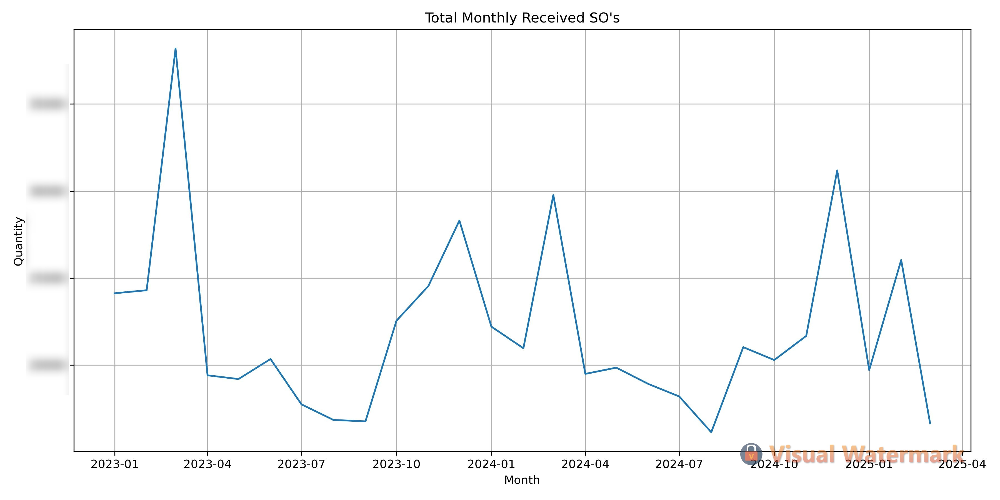
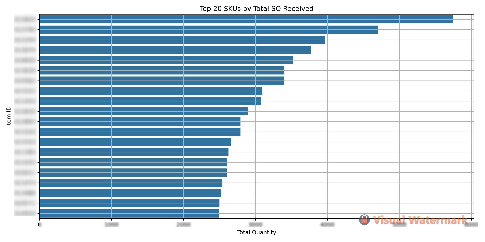
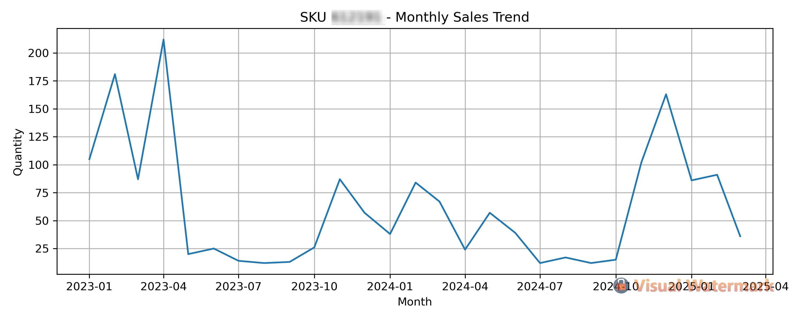
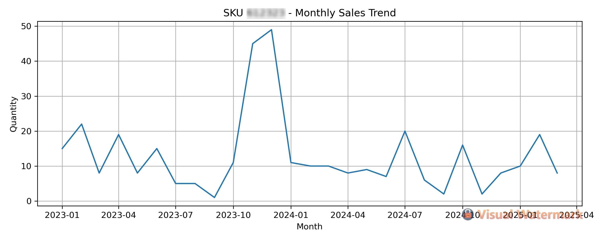
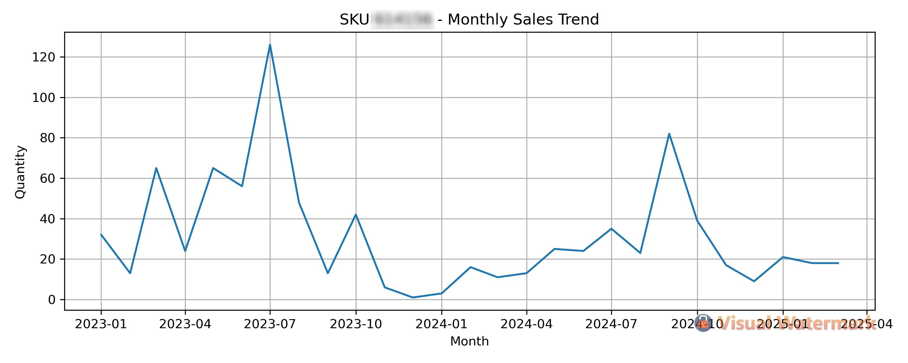

# Python-Based Forecasting Engine for Automotive Chassis SKU Demand with ARIMA and Prophet

Built an end-to-end SKU-level demand forecasting system in Python using Jupyter Notebooks, leveraging Prophet and ARIMA models to predict monthly sales for 12,000+ automotive chassis parts—enabling data-driven procurement decisions and improving inventory efficiency across the supply chain.

##  Table of Contents

- [Overview](#overview)
- [Objectives](#objectives)
- [Forecasting Approach](#forecasting-approach)
- [Technologies Used](#technologies-used)

###  Step 1 – Data Cleaning & Preparation
- [Step 1.1: Import Necessary Libraries](#step-11-import-necessary-libraries)
- [Step 1.2: Load the Data from CSV](#step-12-load-the-data-from-csv)
- [Step 1.3: Initial Data Cleaning](#step-13-initial-data-cleaning)
- [Step 1.4: Filter Data from 2023 Onward](#step-14-filter-data-from-2023-onward)
- [Step 1.5: Aggregate Monthly Sales per SKU](#step-15-aggregate-monthly-sales-per-sku)
- [Step 1.6: Identify Top SKUs](#step-16-identify-top-skus)
- [Step 1.7: Separate monthly_sku_data](#step-17-separate-monthly_skudata)
- [Step 1.8: Export Datasets](#step-18-export-datasets)

###  Step 2 – Exploratory Data Analysis (EDA)
- [Step 2.1: Import Data & Libraries](#step-21-import-data--libraries)
- [Step 2.2: Overview of SKU Distribution](#step-22-overview-of-sku-distribution)
- [Step 2.3: Sales Distribution by SKU](#step-23-sales-distribution-by-sku)
- [Step 2.4: Individual SKU Seasonality Check](#step-24-individual-sku-seasonality-check)

###  Step 3A – Prophet Model
- [Step 3A.1: Load Libraries and Normalize Data](#step-3a1-load-libraries-and-normalize-data)
- [Step 3A.2: Create Complete SKU-Month Grid](#step-3a2-create-complete-sku-month-grid)
- [Step 3A.3: Set Training and Test Set](#step-3a3-set-training-and-test-set)
- [Step 3A.4: Prophet Forecasting Loop](#step-3a4-prophet-forecasting-loop)
- [Step 3A.5: Compare Forecast with Actuals](#step-3a5-compare-forecast-with-actuals)
- [Step 3A.6: Evaluate Prophet Forecast Accuracy](#step-3a6-evaluate-prophet-forecast-accuracy)
- [Prophet Forecasting Summary](#wrap-up-prophet-forecasting-approach)

###  Step 3B – ARIMA Model
- [Step 3B.1: Import Required Libraries](#step-3b1--import-required-libraries-for-arima-forecasting)
- [Step 3B.2: Load the Data](#step-3b2--load-the-data)
- [Step 3B.3: Define Training and Test Sets](#step-3b3--define-training-and-test-sets)
- [Step 3B.4: Install and Import ARIMA](#step-3b4--install-and-import-arima)
- [Step 3B.5: Set Up Forecasting Loop with ARIMA](#step-3b5--set-up-forecasting-loop-with-arima)
- [Step 3B.6: Compare ARIMA Forecasts with Actuals](#step-3b6--compare-arima-forecasts-with-actuals)
- [Step 3B.7: Evaluate ARIMA Forecast Accuracy](#step-3b7--evaluate-arima-forecast-accuracy)
- [ARIMA Forecasting Summary](#wrap-up-arima-forecasting-approach)

###  Step 4 – Prophet vs ARIMA Forecast Accuracy Evaluation
- [Step 4.1: Side-by-Side Metric Comparison](#step-4--prophet-vs-arima-forecast-accuracy-evaluation)
- [Final Model Selection](#final-model-selection-choosing-the-most-effective-forecasting-method)

###  Business Value
- [Procurement & Operations Impact](#procurement--operations-impact)
- [Executive Summary](#executive-summary)

---

## Overview
This project delivers a complete demand forecasting system built in Python using Jupyter Notebooks, specifically designed for the automotive parts industry with a focus on chassis components. Using historical sales order data from 2023 onward, the workflow trains and compares two time series forecasting models: ARIMA and Prophet.

The objective is to accurately forecast monthly demand for over 12,000 unique SKUs, enabling data-driven procurement and inventory planning. Each model is evaluated using RMSE, MAE, and MAPE to ensure practical performance in SKU-level forecasting scenarios.

Development was conducted entirely in Python using libraries such as Pandas, scikit-learn, pmdarima, and Prophet. The project emphasizes transparency, scalability, and operational impact, with clear documentation for both technical and non-technical stakeholders.

### Objectives
Build a scalable and accurate forecasting pipeline for monthly demand of automotive chassis SKUs

Train and compare ARIMA and Prophet models to assess forecasting performance across thousands of individual part numbers

Enable data-driven procurement planning by translating raw sales data into reliable demand projections

Evaluate model effectiveness using RMSE, MAE, and MAPE metrics

Document the process end-to-end for operational reproducibility and stakeholder transparency


### Forecasting Approach

The forecasting strategy was designed to balance scalability, accuracy, and computational efficiency, considering the large number of automotive chassis SKUs.

- **Individual Forecasting**: Each SKU was forecasted individually using both Prophet and ARIMA models. This approach provides SKU-specific insight and accommodates unique sales patterns and volumes.
  
- **Full Forecast Coverage**: Unlike hybrid strategies that only model top-performing SKUs, this project executed per-SKU modeling for the entire SKU catalog (~12,000 items), thanks to automation via `tqdm` and efficient data handling in Python.
  
- **Forecast Horizon**: The models were trained on monthly sales data from January 2023 to August 2024, and were used to forecast for the next 7 months (September 2024 to March 2025).

- **Prophet and ARIMA Configuration**:
  - *Prophet*: Default configuration with additive seasonality; negative or near-zero outputs were clipped to zero for business relevance.
  - *ARIMA*: Automatically optimized using `auto_arima()` with no seasonality. In cases of model failure, a 3-month fallback average was used to ensure full SKU coverage.

- **Evaluation**: Forecasts were compared against actual sales using RMSE, MAE, and MAPE to determine model effectiveness across the forecast period.


### Technologies Used

- **Python 3.10+**  
  Core programming language used for data preprocessing, modeling, and evaluation

- **Jupyter Notebook**  
  Interactive development environment used for building and documenting the workflow

- **Pandas**  
  Data manipulation and transformation of large-scale SKU-level sales records

- **NumPy**  
  Numerical computations and array operations

- **scikit-learn**  
  Evaluation metrics including RMSE, MAE, and MAPE

- **Prophet**  
  Time series forecasting library developed by Meta, used for modeling trend and seasonality

- **pmdarima (auto_arima)**
  ARIMA model training and parameter selection with minimal manual tuning

- **tqdm**  
  Progress bar utility for visualizing forecast loops across thousands of SKUs


## Step 1 - Data Cleaning & Preparation

This section focuses on importing, filtering, and organizing the raw sales order data into a clean, structured format suitable for forecasting analysis.

The original dataset contains transactional-level entries for customer sales orders (SOs). To ensure accurate time series modeling, we:

- Removed irrelevant rows with missing or zero quantities.
- Standardized the date field and filtered data starting from 2023.
- Aggregated order quantities by SKU on a monthly basis to generate a consistent time series.
- Identified and separated the top 500 SKUs based on total sales volume for individual modeling.
- Exported three cleaned datasets: top SKUs, remaining SKUs, and the full SKU population.

This preprocessing lays the foundation for accurate modeling by eliminating noise, aligning temporal granularity, and ensuring completeness across all time periods.

### Data Cleaning & Preparation Steps with Explanations
#### Step 1.1: Import Necessary Libraries

This initial step sets up the Python environment with essential libraries required for data manipulation, numerical computation, and date handling. It also adjusts display settings for better visibility when working with DataFrames in a notebook environment.

**What Below Code Does:**

- import pandas as pd: Loads the pandas library, which is the backbone of all data manipulation in this project. It allows us to work with structured datasets using DataFrames.

- import numpy as np: Imports NumPy, which is used for numerical operations, especially when performing calculations like averages, error metrics, or transformations.

- from datetime import datetime: Enables parsing and manipulation of date/time values, useful for converting and comparing dates across datasets.

- pd.set_option('display.max_columns', None): Modifies pandas' display settings so all columns in a DataFrame are shown when printed. This is especially helpful when inspecting wide datasets with many variables.

```python
# Step 1.1
# Import Libraries
import pandas as pd
import numpy as np

# To handle dates appropriately
from datetime import datetime

# Display options
pd.set_option('display.max_columns', None)

```
---

#### Step 1.2: Load the Data from CSV

In this step, we load the raw sales order data into a pandas DataFrame from a CSV file. This file will serve as the foundation for all subsequent preprocessing, analysis, and forecasting.

What the Below Code Does:

- pd.read_csv(...): Reads the specified CSV file into a pandas DataFrame named data.

- The r before the string ensures the file path is treated as a raw string, so backslashes aren't misinterpreted.

- The encoding='ISO-8859-1' parameter ensures that any special or non-UTF-8 characters (common in ERP exports or regional encodings) are read correctly without causing decoding errors.

- data.head(): Displays the first five rows of the dataset. This is useful for a quick sanity check to verify that the file was loaded properly and the data structure is as expected.

```python
# Step 1.2
# Load data from your CSV file
data = pd.read_csv(r'V:\DATA\SO_FORECAST.CSV', encoding='ISO-8859-1')

# Preview first 5 rows
data.head()

```

---

#### Step 1.3: Initial Data Cleaning

This step filters the raw data to retain only meaningful and usable entries for downstream forecasting. Sales transactions with missing or zero values are excluded, as they do not contribute useful signals to demand forecasting models.

**What Below Code Does:**

- `print(f"...")`: Displays the total number of rows in the dataset before cleaning using f-string formatting.
- `data['Quantity'].notnull()`: Filters out rows where the `Quantity` field is missing (null).
- `(data['Quantity'] != 0)`: Filters out rows with a `Quantity` of 0, which are not useful for demand forecasting.
- Boolean indexing: Applies both conditions to retain only valid quantity records.
- `data_clean[data_clean['Item ID'].notnull()]`: Further removes rows with missing `Item ID`, ensuring every record can be mapped to a specific product.
- Final print: Outputs the total number of rows remaining after cleaning, useful for verifying the effect of the filters.

```python
# Step 1.3
# Check initial row count : The f prefix means “formatted string”.Everything inside the {} is evaluated as Python code, and its result is inserted into the string.data.shape[0] gives just the row count.

print(f"Initial Rows: {data.shape[0]}")

# Remove rows with Quantity = 0 or Quantity is null : Boolean indexing — selecting rows where a certain condition is True

data_clean = data[data['Quantity'].notnull() & (data['Quantity'] != 0)]

# Remove rows with null Item ID
data_clean = data_clean[data_clean['Item ID'].notnull()]

# Check rows after cleaning
print(f"Rows after cleaning: {data_clean.shape[0]}")
```

---

#### Step 1.4 - Filter Data from 2023 Onward

To ensure our forecasting model is trained on recent and relevant data, we restrict the dataset to sales occurring in 2023 and later.

**What Below Code Does:**

- Converts the `Date` column into proper datetime format using `pd.to_datetime`, coercing any invalid formats to `NaT` (Not a Time).
- Filters the dataset to include only rows with a `Date` on or after January 1, 2023 — ensuring recent and relevant data for forecasting.
- Uses `.copy()` to avoid `SettingWithCopyWarning` and maintain data integrity.
- Prints the number of rows that meet the date criteria, confirming the filtered dataset size.


```python
# Step 1.4
# Convert 'Date' to datetime
data_clean['Date'] = pd.to_datetime(data_clean['Date'], errors='coerce')

# Filter data from 2023 onwards
data_2023 = data_clean[data_clean['Date'] >= '2023-01-01'].copy()

# Check rows after filtering
print(f"Rows from 2023 onwards: {data_2023.shape[0]}")
```

---

#### Step 1.5 - Aggregate Monthly Sales per SKU

This step transforms raw transaction-level data into a structured monthly time series format suitable for forecasting.

**What Below Code Does:**

- Creates a new column `YearMonth` by converting each date into a monthly period using `.dt.to_period('M')`.
- Groups the dataset by `YearMonth` and `Item ID`, then sums the `Quantity` values to get total units sold per SKU each month.
- Resets the index after aggregation to return a clean DataFrame.
- Renames columns for clarity and consistency in later steps (`Item ID` becomes `Item_ID`, and `Quantity` becomes `Monthly_Quantity`).
- Displays the first few rows of the aggregated result to verify correctness.

```python
# Step 1.5
# Create Year-Month column
data_2023['YearMonth'] = data_2023['Date'].dt.to_period('M')

# Aggregate monthly quantities per SKU
monthly_sku_data = data_2023.groupby(['YearMonth', 'Item ID']).agg({
    'Quantity': 'sum'
}).reset_index()

# Rename columns clearly
monthly_sku_data.columns = ['YearMonth', 'Item_ID', 'Monthly_Quantity']

# Check aggregated data
monthly_sku_data.head()
```
---

#### Step 1.6 - Identify Top SKUs

This step helps narrow the scope of forecasting to the most impactful products by identifying the top 500 SKUs based on historical sales volume.

**What Below Code Does:**

- Groups the monthly data by `Item_ID` and sums total sales across all months.
- Sorts the SKUs in descending order of total quantity sold.
- Selects the top 500 SKUs, which will be prioritized for forecasting due to their high volume and business impact.
- Renames the aggregated sales column to `Total Sales Quantity` for better readability in outputs.
- Displays the top 10 SKUs as a preview.


```python
# Step 1.6
# Get total quantities per SKU to identify top SKUs
total_qty_per_sku = monthly_sku_data.groupby('Item_ID')['Monthly_Quantity'].sum().reset_index()

# Sort SKUs by descending quantity
top_skus = total_qty_per_sku.sort_values(by='Monthly_Quantity', ascending=False).head(500)
top_skus = top_skus.rename(columns={'Monthly_Quantity': 'Total Sales Quantity'})

# Check top SKUs
top_skus.head(10)
```
---

#### Step 1.7 - Separate `monthly_sku_data`

After identifying the top 500 SKUs, this step splits the full monthly sales dataset into two groups: one for high-volume SKUs and one for all others.

**What Below Code Does:**

- Filters `monthly_sku_data` to include only rows for SKUs that are in the top 500 list, storing them in `top_sku_data`.
- Uses the inverse condition to capture all other SKUs not in the top 500, assigning them to `remaining_sku_data`.
- Prints row counts for both groups and the total to validate the separation and ensure no data is lost.


```python
# Step 1.7
# Top 500 SKUs data
top_sku_data = monthly_sku_data[monthly_sku_data['Item_ID'].isin(top_skus['Item_ID'])]

# Remaining SKUs data
remaining_sku_data = monthly_sku_data[~monthly_sku_data['Item_ID'].isin(top_skus['Item_ID'])]

# Preview data
print(f"Top SKUs data rows: {top_sku_data.shape[0]}")
print(f"Remaining SKUs data rows: {remaining_sku_data.shape[0]}")
print(f"All SKUs data rows: {monthly_sku_data.shape[0]}")
```

---

#### Step 1.8 - Export Datasets

To prepare for modeling and analysis, this step saves the cleaned and segmented datasets as CSV files.

**What Below Code Does:**

- Saves the monthly data for top 500 SKUs to `top_sku_monthly.csv`.
- Saves the remaining SKUs' monthly data to `remaining_sku_monthly.csv`.
- Exports the full dataset of all SKUs to `all_sku_monthly.csv`.
- These files will be used in later steps for forecasting with Prophet and ARIMA.

```python
# Step 1.8
# Export datasets
top_sku_data.to_csv('top_sku_monthly.csv', index=False)
remaining_sku_data.to_csv('remaining_sku_monthly.csv', index=False)
monthly_sku_data.to_csv('all_sku_monthly.csv', index=False)
```

---

In this section, we performed essential preprocessing to ensure our dataset was clean and ready for reliable forecasting. The key actions included:

- **Removed invalid entries**: Rows with `null` or `0` quantities were filtered out to avoid skewing the results.
- **Ensured SKU validity**: Entries without a valid `Item ID` were excluded, as each SKU must be uniquely identifiable.
- **Filtered time range**: Data was limited to entries from January 1, 2023, onward to focus on recent sales patterns.
- **Grouped and aggregated**: Cleaned daily data was aggregated monthly per SKU to simplify modeling and reduce noise.
- **Segmented dataset**: SKUs were divided into two categories:
  - `top_sku_data`: The top 500 SKUs by total quantity sold.
  - `remaining_sku_data`: All other SKUs.
- **Exported datasets**: Cleaned and grouped data was exported into three separate CSV files for streamlined access:
  - `top_sku_monthly.csv`
  - `remaining_sku_monthly.csv`
  - `all_sku_monthly.csv`

This structured approach improves model performance by ensuring consistent and high-quality input data.

---

## Step 2 - Exploratory Data Analysis (EDA)

Before building any forecasting models, it is essential to understand the underlying structure, volume, and variability of the data. In this section, we explore trends in monthly sales orders across all SKUs, identify top-performing parts, and evaluate whether any seasonality exists.

### EDA Objective

- Get familiar with the data
- Validate the integrity and time coverage of the cleaned sales data.
- Visually assess whether certain SKUs exhibit patterns such as trends, spikes, or seasonality.
- Align business knowledge with observed patterns

### EDA Steps with Explanations

#### Step 2.1 - Import Data & Libraries

To begin exploratory analysis, we first import the necessary libraries and load the cleaned monthly sales data.

**What Below Code Does:**

- Imports `pandas` for data manipulation and `matplotlib.pyplot` / `seaborn` for visualizations.
- Loads the `monthly_sku_data.csv` file created during preprocessing.
- Converts the `YearMonth` column from string to datetime format for proper time-based analysis and plotting.


```python
import pandas as pd
import matplotlib.pyplot as plt
import seaborn as sns

# Load your cleaned monthly SKU data
monthly_data = pd.read_csv('monthly_sku_data.csv')

# Convert 'YearMonth' to datetime
monthly_data['YearMonth'] = pd.to_datetime(monthly_data['YearMonth'].astype(str))
```
---

#### Step 2.2 - Overview of SKU Distribution

This step provides a high-level view of the dataset’s SKU diversity and monthly sales coverage.

**What Below Code Does:**

- Prints the number of unique SKUs (Item_ID) in the dataset.
- Displays the date range covered in the dataset by identifying the earliest and latest `YearMonth`.
- Aggregates total monthly sales quantities across all SKUs.
- Uses Seaborn to plot a line graph showing overall monthly sales trend over time.
- Labels the plot with appropriate titles and axis labels for clarity.
- Saves the plot as a high-resolution JPEG file for use in presentations or reports.

```pyton
# Step 2.2
# Number of unique SKUs
print("Unique SKUs:", monthly_data['Item_ID'].nunique())

# Monthly time range
print("Date Range:", monthly_data['YearMonth'].min(), "to", monthly_data['YearMonth'].max())

# Plot: Monthly sales volume trend (Total)
monthly_trend = monthly_data.groupby('YearMonth')['Monthly_Quantity'].sum().reset_index()

plt.figure(figsize=(12, 6))
sns.lineplot(data=monthly_trend, x='YearMonth', y='Monthly_Quantity')
plt.title("Total Monthly Received SO's")
plt.xlabel("Month")
plt.ylabel("Quantity")
plt.grid(True)

plt.tight_layout()
plt.savefig("monthly_so_trend.jpg", format='jpg', dpi=300)

plt.show()
```


---

#### Step 2.3 - Sales Distribution by SKU

This step explores how total sales are distributed across different SKUs, highlighting the most in-demand items.

**What Below Code Does:**

- Groups data by `Item_ID` and sums up `Monthly_Quantity` to get total sales per SKU.
- Sorts the SKUs in descending order based on total quantity.
- Selects the top 20 SKUs with the highest total sales.
- Converts SKU identifiers to strings to ensure they display correctly on the y-axis of the plot.
- Creates a horizontal bar chart showing the total sales volume for the top 20 SKUs.
- Adds plot titles, labels, and gridlines for better readability.


```python
# Step 2.3: Sales Distribution by SKU
# Total sales per SKU
sku_totals = monthly_data.groupby('Item_ID')['Monthly_Quantity'].sum().sort_values(ascending=False)

# Convert index (Item_IDs) to string for better y-axis labels
top_20 = sku_totals.head(20)
top_20.index = top_20.index.astype(str)

plt.figure(figsize=(12, 6))
sns.barplot(x=top_20.values, y=top_20.index)
plt.title("Top 20 SKUs by Total SO Received")
plt.xlabel("Total Quantity")
plt.ylabel("Item ID")
plt.grid(True)
plt.show()
```


---

#### Step 2.4 - Individual SKU Seasonality Check

This step examines whether certain SKUs display seasonal patterns or irregular trends in their monthly sales data. By isolating individual SKUs and visualizing their month-by-month sales over time, we can better understand their behavior and determine the most appropriate forecasting approach.

**What Below Code Does:**

- Selects a single SKU from the dataset to evaluate its sales trend.
- Generates a line plot showing monthly quantities sold for that SKU.
- Reveals whether the sales pattern is seasonal, volatile, or flat.
- Supports decisions regarding whether to apply seasonal models like Prophet or simpler models like ARIMA without seasonality.
- Helps stakeholders and forecasters visually validate SKU-specific trends before modeling.

```python

# Step 2.4: Individual SKU Seasonality Check
import os
export_folder = "sku_charts"
os.makedirs(export_folder, exist_ok=True)

sample_skus = monthly_data['Item_ID'].value_counts().head(3).index.tolist()

for sku in sample_skus:
    temp = monthly_data[monthly_data['Item_ID'] == sku]
    plt.figure(figsize=(10, 4))
    sns.lineplot(data=temp, x='YearMonth', y='Monthly_Quantity')
    plt.title(f'SKU {sku} - Monthly Sales Trend')
    plt.xlabel("Month")
    plt.ylabel("Quantity")Supports decisions regarding whether to apply seasonal models like Prophet or simpler models like ARIMA without seasonality.
- Helps stakeholders and forecasters visually validate SKU-specific trends before modeling.
    plt.grid(True)

# Export before showing
    filename = f"{export_folder}/sku_{sku}_sales_trend.jpg"
    plt.tight_layout()
    plt.savefig(filename, format='jpg', dpi=300)
    
    plt.show()
```




### Exploratory Data Analysis (EDA) Summary

Prior to modeling, we conducted exploratory data analysis to understand the overall sales patterns of our chassis part SKUs. The analysis revealed:

- A wide range of SKU sales volumes, with a small subset of parts accounting for the majority of overall demand.
- No strong seasonality patterns were observed across most SKUs when visualized monthly. This aligns with industry expectations, as chassis parts (e.g., control arms, bushings, sway bars) are typically replaced based on wear-and-tear or damage, rather than cyclical or seasonal patterns like tires or AC units.
- Demand across SKUs is relatively sporadic, with many items showing irregular purchase intervals, especially among lower-volume SKUs.

This EDA step was critical to validate model selection strategies and to set realistic expectations for forecast behavior across the SKU portfolio.

---

## Step 3A - Prophet Model

In this section, we implement a modular forecasting pipeline using Facebook Prophet, a powerful time series model developed for business applications with seasonality and trend components. Prophet is particularly well-suited for datasets with clear temporal structure and missing data, and it allows for interpretable forecasting at scale. We train a separate model for each SKU using monthly sales data from January 2023 to August 2024, forecast the next 7 months, and clean the results for usability. Prophet’s strength lies in its ability to model trends automatically and generate forecasts that can adapt to the dynamic behavior of each product, making it ideal for demand planning and procurement decisions.

### Dataset Overview

- Source: Internal daily sales order data (2015–2025)
- Preprocessed To: Monthly aggregated SKU-level quantities
- Date Field Used: YearMonth
- Forecast Target: Monthly_Quantity per SKU

### Key Design Decisions

#### 1) End-of-Month (MonthEnd) Alignment

Prophet outputs forecast dates at the end of each month (e.g. 2023-01-31, 2023-02-28).

To ensure all joins, evaluations, and comparisons work without mismatch:

- All YearMonth values were explicitly converted using:

```python
monthly_data['YearMonth'] = pd.to_datetime(monthly_data['YearMonth'].astype(str)) + pd.offsets.MonthEnd(0)
```
This ensures that every timestamp reflects the last day of each month.

- The SKU-date grid (full_date_range) was generated using:

```python
full_date_range = pd.date_range(start='2023-01-01', end='2025-03-31', freq='ME')
```
The freq='ME' option ensures all generated dates are end-of-month values, matching Prophet's output.

#### 2) Training/Test Split Logic

| Type        | Date Range                    |
|-------------|-------------------------------|
| Training    | 2023-01-31 to 2024-08-31       |
| Forecasting | 2024-09-30 to 2025-03-31       |

Prophet is fit on training data and asked to predict the next 7 months. There is no overlap between training and forecast periods, ensuring honest evaluation.

#### 3) Forecast Granularity

- Each SKU is trained and forecasted individually using Prophet.
- Forecasts are stored as a combined DataFrame with Item_ID, ForecastMonth, and Forecasted_Quantity.

### Facebook Prophet Pipeline Steps with Explanations

#### Step 3A.1 - Load Libraries and Normalize Data

This step sets up the foundational environment by importing required libraries and preparing the monthly sales dataset for forecasting.

**What the Below Code Does:**

- Imports essential libraries:
  - `pandas` for data handling,
  - `numpy` for numerical operations,
  - `product` from `itertools` to create all combinations of SKUs and dates later on.
- Reads the `all_sku_monthly.csv` file, which contains monthly sales quantities by SKU.
- Ensures the `YearMonth` column is treated as a proper datetime object.
- Applies `.MonthEnd(0)` to shift all date values to the last calendar day of their respective month. This ensures consistency with Prophet, which generates forecasts using end-of-month timestamps by default.

```python
import pandas as pd
import numpy as np
from itertools import product

# Load your existing monthly SKU data
monthly_data = pd.read_csv("all_sku_monthly.csv")
# Convert to end of month to align with Prophet forecast output
monthly_data['YearMonth'] = pd.to_datetime(monthly_data['YearMonth'].astype(str)) + pd.offsets.MonthEnd(0)
```

---

#### Step 3A.2 - Create Complete SKU-Month Grid

This step ensures that every SKU has an entry for every month, even if there were no sales in that month. This is essential for time series forecasting models like Prophet that expect continuous and evenly spaced time intervals.

What the below code does:

- Creates a list of all month-end dates from January 2023 to March 2025 using `pd.date_range` with `'ME'` (month-end) frequency.
- Extracts the list of all unique `Item_ID`s (SKUs) from the dataset.
- Uses `product()` from `itertools` to generate all possible combinations of SKU and month-end date.
- Constructs a new DataFrame called `sku_month_combinations` from these combinations.
- Performs a left join with the original sales data to merge actual sales values into the complete SKU-month grid.
- Fills any missing `Monthly_Quantity` values with 0, ensuring that SKUs with no sales in a given month are represented as zero.
- Saves the completed dataset to a new CSV file `all_sku_monthly_w0.csv` for downstream modeling and evaluation.


```python

full_date_range = pd.date_range(start='2023-01-01', end='2025-03-31', freq='ME')

sku_list = monthly_data['Item_ID'].unique()

sku_month_combinations = pd.DataFrame(list(product(sku_list, full_date_range)), columns=['Item_ID', 'YearMonth'])

all_sku_monthly_w0 = pd.merge(sku_month_combinations, monthly_data, on=['Item_ID', 'YearMonth'], how='left')

all_sku_monthly_w0['Monthly_Quantity'] = all_sku_monthly_w0['Monthly_Quantity'].fillna(0)

all_sku_monthly_w0.to_csv("all_sku_monthly_w0.csv", index=False)

all_sku_monthly_w0.head()
```

---

#### Step3A.3 - Set Training and Test Set

- This step splits the time series data into a training set and a test (evaluation) set to allow proper model validation and performance assessment.

- By reserving the most recent 7 months as a test set, we can simulate a real-world forecasting scenario, where future demand is unknown and needs to be predicted.


```python
# Training set (historical)
training_data = all_sku_monthly_w0[
    (all_sku_monthly_w0['YearMonth'] >= '2023-01-31') & 
    (all_sku_monthly_w0['YearMonth'] <= '2024-08-31')
]

# Test set (evaluation)
test_data = all_sku_monthly_w0[
    (all_sku_monthly_w0['YearMonth'] >= '2024-09-30') & 
    (all_sku_monthly_w0['YearMonth'] <= '2025-03-31')
]
```

---

#### Step3A.4 - Prophet Forecasting Loop

In this step, I build a monthly sales forecast for each SKU using Facebook Prophet, a time series model that captures seasonality and trend.

We train a separate model for each SKU, forecast 7 months into the future, and clean the results for interpretability.

**What Below Code Does:**

- Loops through each SKU and trains a standalone Prophet model on its monthly sales data.
- Forecasts 7 months ahead, using the .make_future_dataframe() method.
- Adds Item_ID to the forecast output so we can trace predictions back to the SKU.
- Handles any modeling errors gracefully with a try-except block.
- Cleans the output by:
  - Replacing negative predictions and tiny decimals (e.g. 8.88e-16) with 0.
  - Rounding all values to 2 decimal places for neatness.
- Exports the forecast to prophet_full_forecast.csv.


```python
# Step3A.4 Forecast Using Prophet

from prophet import Prophet
from tqdm import tqdm
import warnings


#Imports Python's built-in warnings module and suppresses warning messages. This cleans up the output by hiding minor warnings (common with Prophet).
warnings.filterwarnings("ignore")

# Store forecasts
prophet_forecasts_nofilter = []

# Forecast loop
for sku in tqdm(sku_list):
    sku_train_df = training_data[training_data['Item_ID'] == sku][['YearMonth', 'Monthly_Quantity']]

    # Skip SKUs with zero historical sales
    if sku_train_df['Monthly_Quantity'].sum() == 0:
        continue

    # Prepare data for Prophet
    prophet_df = sku_train_df.rename(columns={'YearMonth': 'ds', 'Monthly_Quantity': 'y'})

    try:
        model = Prophet()
        model.fit(prophet_df)

        future = model.make_future_dataframe(periods=7, freq='M')
        forecast = model.predict(future)

        forecast['Item_ID'] = sku
        prophet_forecasts_nofilter.append(forecast)

    except Exception as e:
        print(f"SKU {sku} error: {e}")

# Combine results
prophet_forecast_df = pd.concat(prophet_forecasts_nofilter, ignore_index=True)
prophet_forecast_df.rename(columns={'ds': 'ForecastMonth', 'yhat': 'Forecasted_Quantity'}, inplace=True)

# Clean Prophet forecasts (no negative or near-zero values)
prophet_forecast_df['Forecasted_Quantity'] = prophet_forecast_df['Forecasted_Quantity'].apply(
    lambda x: 0 if x < 0 or abs(x) < 1e-5 else round(x, 2)
)

# Save forecast data
prophet_forecast_df.to_csv("prophet_full_forecast.csv", index=False)
```

---

#### Step3A.5 - Compare Forecast with Actuals

After generating SKU-level forecasts with Prophet, we compare those predictions to the actual observed sales. This comparison allows us to evaluate model accuracy and prepare for metric calculations such as RMSE, MAE, and MAPE.

**What Below Code Does:**

- Creates a new comparison DataFrame that aligns forecasted and actual values for each SKU and each month.
- Renames YearMonth to ForecastMonth so it can match Prophet’s output format and maintain clarity.
- Uses a left join so all actuals are preserved — even if no forecast was generated (e.g. due to skipped or failed SKUs).
- Fills missing forecasted values with 0, assuming the model didn’t produce a result for those entries.
- Adds a new column called Forecast_Error, representing the difference between forecasted and actual sales quantity.
- Saves the full comparison to a CSV file, which can be used for evaluation or visualization.

```python
# Step3A.5 Compare Forecast with Actuals

# Prepare DataFrames
actual_df = all_sku_monthly_w0.copy()
actual_df.rename(columns={'YearMonth': 'ForecastMonth', 'Monthly_Quantity': 'Actual'}, inplace=True)

forecast_df = prophet_forecast_df.copy()

# Merge Actuals LEFT JOIN Forecasts
comparison_df = pd.merge(
    actual_df[['ForecastMonth', 'Item_ID', 'Actual']],
    forecast_df[['ForecastMonth', 'Item_ID', 'Forecasted_Quantity']],
    on=['ForecastMonth', 'Item_ID'],
    how='left'  # Keep all actuals
)

# Fill missing Forecasted_Quantity with 0
comparison_df['Forecasted_Quantity'] = comparison_df['Forecasted_Quantity'].fillna(0)

# Calculate Forecast_Error
comparison_df['Forecast_Error'] = comparison_df['Forecasted_Quantity'] - comparison_df['Actual']

# Save the full comparison
comparison_df.to_csv("actual_vs_prophet_forecasts.csv", index=False)

print("✅ Full Forecast vs Actual (Full Lineup) Saved: 'actual_vs_prophet_forecasts.csv'")
```

---

#### Step3A.6 - Evaluate Prophet Forecast Accuracy

In this step, we compute standard forecast accuracy metrics — RMSE, MAE, and MAPE — by comparing the forecasted quantities with actual sales from the test period (2024-09-30 to 2025-03-31).
These metrics help quantify how well the Prophet model performed in a real-world scenario.

**What Below Code Does:**

- Loads the comparison file actual_vs_prophet_forecasts.csv created earlier.
- Converts the ForecastMonth column to datetime to enable time-based filtering.
- Converts the ForecastMonth column to datetime to enable time-based filtering.
- Computes three metrics:
  - RMSE (Root Mean Squared Error): Sensitive to large errors; penalizes big misses more.
  - MAE (Mean Absolute Error): Average absolute difference between prediction and reality.
  - MAPE (Mean Absolute Percentage Error): Expresses error as a % of the actual — but only calculated where actual ≠ 0 to avoid undefined results.
- Prints all metrics, rounded to 2 decimal places for reporting.

```python
import pandas as pd
from sklearn.metrics import (
    root_mean_squared_error,
    mean_absolute_error,
    mean_absolute_percentage_error
)

# Load and prepare forecast comparison file
comparison_df = pd.read_csv("actual_vs_prophet_forecasts.csv")
comparison_df['ForecastMonth'] = pd.to_datetime(comparison_df['ForecastMonth'])

# Filter to forecast horizon only
eval_df = comparison_df[comparison_df['ForecastMonth'] >= '2024-09-30']

# Compute metrics
rmse = root_mean_squared_error(eval_df['Actual'], eval_df['Forecasted_Quantity'])
mae = mean_absolute_error(eval_df['Actual'], eval_df['Forecasted_Quantity'])

# Avoid divide-by-zero issue in MAPE by filtering out zero-actual rows
nonzero_eval_df = eval_df[eval_df['Actual'] != 0]
mape = mean_absolute_percentage_error(
    nonzero_eval_df['Actual'],
    nonzero_eval_df['Forecasted_Quantity']
) * 100

# Display results
print(f"RMSE: {rmse:.2f}")
print(f"MAE: {mae:.2f}")
print(f"MAPE: {mape:.2f}%")
```
### Wrap-Up: Prophet Forecasting Approach

In this section, we implemented a robust forecasting pipeline using Facebook Prophet, tailored for monthly SKU-level demand prediction. We trained individual models for over 12,000 SKUs using sales data from January 2023 to August 2024, then generated 7-month ahead forecasts through March 2025. After aligning the forecast output with actual sales data, we evaluated performance using standard accuracy metrics — RMSE, MAE, and MAPE. Additionally, we refined Prophet’s output by eliminating negative and near-zero predictions, ensuring the results were both interpretable and production-ready. This forecasting framework provides a scalable and transparent foundation for inventory planning and supplier ordering decisions.

---

## Step 3B - ARIMA Model

In this section, we implement a second forecasting approach using ARIMA (AutoRegressive Integrated Moving Average) - powerful statistical model for time series forecasting. Unlike Prophet, ARIMA does not assume predefined seasonal patterns or trend components. Instead, it learns temporal dependencies from past sales data and is well-suited for datasets with consistent time intervals and moderate history length. We train a separate ARIMA model for each SKU using historical monthly sales, forecast the next 7 months, and apply post-processing steps to clean and store the results. This section enables a direct, head-to-head comparison with Prophet to determine which modeling technique better captures sales behavior in our dataset.

### Step 3B.1 – Import Required Libraries for ARIMA Forecasting

Before we begin building ARIMA-based forecasts, we import the necessary Python libraries for data manipulation, iteration, and silent error handling. These are foundational tools used throughout the modeling pipeline.

**What Below Code Does:**

- pandas, The core library for handling structured data. I use it to load CSV files, manipulate time series, and structure forecast outputs.
- numpy,  Enables efficient numerical operations, such as filling or transforming arrays and computing statistical measures.
- tqdm, Provides a real-time progress bar in loops, especially useful for tracking the per-SKU forecasting loop over thousands of SKUs.
- warnings.filterwarnings("ignore"), Silences non-critical warnings (often thrown by ARIMA internals), keeping output clean and focused during batch processing.

```python
# Load the monthly SKU data including zero-sales months
all_sku_monthly_w0 = pd.read_csv("all_sku_monthly_w0.csv")

# Ensure correct date format
all_sku_monthly_w0['YearMonth'] = pd.to_datetime(all_sku_monthly_w0['YearMonth'])
```
---

### Step 3B.2 – Load the data

To build reliable ARIMA models, we start by loading the preprocessed dataset that includes every SKU for every month, even those with zero sales. Ensuring complete time series continuity is crucial for ARIMA, which assumes a fixed time interval between observations.This step ensures we have a clean, gap-free, time-indexed dataset before feeding it into ARIMA.

**What Below Code Does:**
- Reads the preprocessed file all_sku_monthly_w0.csv, which contains a full grid of monthly sales values for each SKU, including months where no units were sold (represented as zeros).
- Converts the YearMonth column into a proper datetime format using pd.to_datetime(). This is critical for ARIMA, which requires time series indices to be uniform and date-aware.

```python
# Step3B.2 - Load the data

# Load the monthly SKU data including zero-sales months
all_sku_monthly_w0 = pd.read_csv("all_sku_monthly_w0.csv")

# Ensure correct date format
all_sku_monthly_w0['YearMonth'] = pd.to_datetime(all_sku_monthly_w0['YearMonth'])
```

---

### Step 3B.3 – Define Training and Test Sets

To evaluate the forecasting accuracy of our ARIMA models, we split the time series data into training and test sets. Each SKU’s historical sales are divided chronologically, with earlier months used to train the model and later months used to test the forecasted values against actual outcomes.

**What Below Code Does:**
- The use of end-of-month-aligned dates (e.g., 2023-01-31) ensures compatibility with Prophet’s outputs and avoids double entries from mismatched date formats.
- Training Set (January 2023 – August 2024): This period provides up to 20 months of historical data per SKU, giving the ARIMA model enough information to learn patterns in demand.
- Test Set (September 2024 – March 2025):This 7-month window represents our forecast horizon. Predictions made by ARIMA will be compared against these real sales figures for evaluation.

```python
# Step3B.3 - Define Training and Test Sets

# Define training set
training_data = all_sku_monthly_w0[
    (all_sku_monthly_w0['YearMonth'] >= '2023-01-31') & 
    (all_sku_monthly_w0['YearMonth'] <= '2024-08-31')
]

# Define test set (forecast period)
test_data = all_sku_monthly_w0[
    (all_sku_monthly_w0['YearMonth'] >= '2024-09-30') & 
    (all_sku_monthly_w0['YearMonth'] <= '2025-03-31')
]
```

---

### Step 3B.4 – Install and Import ARIMA

We use the pmdarima library to automatically fit ARIMA models for each SKU. This library provides the auto_arima() function, which simplifies the model selection process by testing multiple combinations of ARIMA parameters and choosing the best one based on information criteria

**What Below Code Does:**
- !pip install pmdarima installs the pmdarima package, which is a Python wrapper around the well-known statsmodels ARIMA implementation. It includes automatic hyperparameter tuning and seasonal decomposition.
- from pmdarima import auto_arima imports the core function used to build and fit ARIMA models for each SKU.

```python
# Install the pmdarima package (one-time installation)
!pip install pmdarima

# Import the auto_arima function from pmdarima
from pmdarima import auto_arima
```

---

### Step 3B.5 – Set Up Forecasting Loop with ARIMA

In this step, we loop through each unique SKU in the training set, fit a dedicated ARIMA model for each one, and forecast sales for the next 7 months. This logic enables independent forecasting per SKU and includes built-in fallbacks to ensure no product is left behind due to model fitting errors.

**What Below Code Does:**
- SKU-by-SKU Training Loop:
  - Iterates through each unique SKU, filters relevant training data, and fits an individual ARIMA model.
- Model Fitting:
  - Uses auto_arima() with seasonal=False to allow the model to find the best non-seasonal (p,d,q) configuration using stepwise optimization. This keeps it lightweight and avoids overfitting.
- Fallback Handling:
  - If ARIMA fails to converge or throws an exception (common for sparse data), a fallback mechanism replaces the forecast with a flat average of the last 3 months.
- Forecast Post-Processing: Forecasts are sanitized to ensure
  - Negative values are set to 0
  - Extremely small values (e.g., 1e-16) are also zeroed
  - Values are rounded to 2 decimals for readability
- Final Output:
  - All forecasts are stored in a single DataFrame and exported to arima_full_forecast.csv for later evaluation.

 ```python
# Step3B.5 - Set up forecasting loop

# Prepare list to store forecasts
arima_forecasts = []

# Get unique SKUs
sku_list = training_data['Item_ID'].unique()

# Forecasting loop
for sku in tqdm(sku_list):
    # Filter the training data for the current SKU
    sku_train_df = training_data[training_data['Item_ID'] == sku][['YearMonth', 'Monthly_Quantity']]

    # Skip SKUs with all zero historical sales
    if sku_train_df['Monthly_Quantity'].sum() == 0:
        continue

    # Ensure datetime index
    sku_train_df['YearMonth'] = pd.to_datetime(sku_train_df['YearMonth'])
    sku_train_df.set_index('YearMonth', inplace=True)

    # Extract the target Series for ARIMA
    y = sku_train_df['Monthly_Quantity']

    # Sanity check
    if y.isnull().any():
        print(f"SKU {sku} error: NaNs detected even after cleaning — skipping")
        continue

    try:
        # Fit ARIMA without seasonality
        model = auto_arima(
            y,
            seasonal=False,
            stepwise=True,
            error_action='ignore',
            suppress_warnings=True
        )

        # Forecast next 7 months
        forecast = model.predict(n_periods=7)

    except Exception as e:
        print(f"SKU {sku} error: {e} — using fallback average")

        # Fallback: use 3-month average if ARIMA fails
        fallback_value = y.tail(3).mean()
        forecast = [fallback_value] * 7

    # Store forecast results
    forecast_df = pd.DataFrame({
        'ForecastMonth': pd.date_range(start='2024-09-30', periods=7, freq='M'),
        'Forecasted_Quantity': forecast,
        'Item_ID': sku
    })

    arima_forecasts.append(forecast_df)

# Combine forecasts into single DataFrame
arima_forecast_df = pd.concat(arima_forecasts, ignore_index=True)

# Fix negative and scientific notation values
arima_forecast_df['Forecasted_Quantity'] = arima_forecast_df['Forecasted_Quantity'].apply(
    lambda x: 0 if x < 0 or abs(x) < 1e-5 else round(x, 2)
)

# Save forecasts to CSV
arima_forecast_df.to_csv("arima_full_forecast.csv", index=False)

# Preview
arima_forecast_df.head()
```

---

### Step 3B.6 – Compare ARIMA Forecasts with Actuals

Once we've generated forecasts for all SKUs, we evaluate model performance by comparing predictions against the actual sales data from the test period. This step ensures we measure how well the ARIMA model performs in real-world forecasting.

**What Below Code Does:**
- Creates a test set by filtering only the actuals from the 7-month forecast window.
- Standardizes the column names (ForecastMonth, Actual) to match the forecast DataFrame and enable clean merging.
- Merges forecasted values with actual sales using a LEFT JOIN, ensuring that even SKUs without forecasted output are preserved for analysis.
- Fills missing forecasts with 0 — this reflects a conservative assumption that no prediction is made for those months.
- Calculates Forecast Error as the difference between forecasted and actual sales.
- Saves the result into a CSV for later metric evaluation and reporting.

```python
# Step3B.6 - Compare Forecast with Actuals
actual_df = all_sku_monthly_w0[
    (all_sku_monthly_w0['YearMonth'] >= '2024-09-30') & 
    (all_sku_monthly_w0['YearMonth'] <= '2025-03-31')].copy()

actual_df.rename(columns={'YearMonth': 'ForecastMonth', 'Monthly_Quantity': 'Actual'}, inplace=True)

forecast_df = arima_forecast_df.copy()

# Merge Actuals LEFT JOIN Forecasts
comparison_df = pd.merge(
    actual_df[['ForecastMonth', 'Item_ID', 'Actual']],
    forecast_df[['ForecastMonth', 'Item_ID', 'Forecasted_Quantity']],
    on=['ForecastMonth', 'Item_ID'],
    how='left'  # Keep all actuals
)

# Fill missing Forecasted_Quantity with 0
comparison_df['Forecasted_Quantity'] = comparison_df['Forecasted_Quantity'].fillna(0)

# (Optional) Calculate Forecast_Error
comparison_df['Forecast_Error'] = comparison_df['Forecasted_Quantity'] - comparison_df['Actual']

# Save the full comparison
comparison_df.to_csv("actual_vs_arima_forecasts.csv", index=False)

print("✅ Full Forecast vs Actual (Full Lineup) Saved: 'Actual_vs_arima_forecasts.csv'")
```

---

### Step 3B.7 – Evaluate ARIMA Forecast Accuracy

To quantify how well ARIMA forecasts performed, we compute standard error metrics: Root Mean Squared Error (RMSE), Mean Absolute Error (MAE), and Mean Absolute Percentage Error (MAPE). These help assess the deviation between predicted and actual sales for the test period.

****What Below Code Does:****
- Loads the forecast vs actual CSV generated in the previous step and parses the ForecastMonth column into datetime format.
- Filters the dataset to include only the forecast horizon: September 2024 to March 2025.
- Calculates:
  - RMSE: Measures average magnitude of error — more sensitive to large errors.
  - MAE: Measures average absolute deviation — more interpretable and stable.
  - MAPE: Calculates average percentage error — ideal for interpreting accuracy as a percentage of actual demand.
- Handles division-by-zero by excluding rows where actual quantity is zero from the MAPE calculation.
- Prints the results in a clean and interpretable format.

### Wrap-Up: ARIMA Forecasting Approach

The ARIMA (AutoRegressive Integrated Moving Average) model was used to forecast monthly sales quantities for over 12,000 unique SKUs. By individually fitting each product's time series using auto_arima() from the pmdarima library, we allowed the model to intelligently select optimal parameters while excluding seasonality to maintain generality.

To ensure completeness and robustness:
- Any SKUs that failed to converge due to statistical instability were automatically handled using a fallback forecast based on the 3-month trailing average.
- Forecasts were post-processed to prevent negative or near-zero outputs, ensuring all predicted quantities were production-ready.
- Evaluation was performed on a 7-month forecast horizon (September 2024 to March 2025), comparing predictions to actual sales using RMSE, MAE, and MAPE.

These metrics allowed us to objectively compare ARIMA against other models (such as Prophet) and determine the most reliable forecasting strategy for procurement planning.

---

## Step 4 – Prophet vs ARIMA Forecast Accuracy Evaluation

This step performs a side-by-side performance comparison of the Prophet and ARIMA models across the same forecast horizon (September 2024 to March 2025). The evaluation uses industry-standard error metrics to quantify which model provided better sales quantity forecasts for the SKUs.

**What Below Code Does:**
- Loads final forecast comparison files for both Prophet and ARIMA.
- Filters only the forecast period (test set: September 2024 – March 2025).
- Computes three key metrics for each model:
  - RMSE: Sensitive to large errors, good for penalizing poor predictions.
  - MAE: Interpretable and stable across scales.
  - MAPE: Expresses error as a percentage of actuals (excluding zeros).
  - Displays all results side-by-side, offering a direct comparison of accuracy between the two approaches.
 
```python
import pandas as pd
from sklearn.metrics import (
    root_mean_squared_error,
    mean_absolute_error,
    mean_absolute_percentage_error
)

# Load comparison datasets
prophet_df = pd.read_csv("actual_vs_prophet_forecasts.csv")
arima_df = pd.read_csv("actual_vs_arima_forecasts.csv")

# Filter to forecast period
prophet_eval = prophet_df[prophet_df['ForecastMonth'] >= '2024-09-30']
arima_eval = arima_df[arima_df['ForecastMonth'] >= '2024-09-30']

# ------------------ Prophet Evaluation ------------------
rmse_prophet = root_mean_squared_error(prophet_eval['Actual'], prophet_eval['Forecasted_Quantity'])
mae_prophet = mean_absolute_error(prophet_eval['Actual'], prophet_eval['Forecasted_Quantity'])

# Remove zero-actuals for MAPE
prophet_mape_df = prophet_eval[prophet_eval['Actual'] != 0]
mape_prophet = mean_absolute_percentage_error(
    prophet_mape_df['Actual'], 
    prophet_mape_df['Forecasted_Quantity']
) * 100

# ------------------ ARIMA Evaluation ------------------
rmse_arima = root_mean_squared_error(arima_eval['Actual'], arima_eval['Forecasted_Quantity'])
mae_arima = mean_absolute_error(arima_eval['Actual'], arima_eval['Forecasted_Quantity'])

arima_mape_df = arima_eval[arima_eval['Actual'] != 0]
mape_arima = mean_absolute_percentage_error(
    arima_mape_df['Actual'], 
    arima_mape_df['Forecasted_Quantity']
) * 100

# ------------------ Results ------------------
print("🔮 Prophet:")
print(f"RMSE: {rmse_prophet:.2f}")
print(f"MAE: {mae_prophet:.2f}")
print(f"MAPE: {mape_prophet:.2f}%")

print("\n📉 ARIMA:")
print(f"RMSE: {rmse_arima:.2f}")
print(f"MAE: {mae_arima:.2f}")
print(f"MAPE: {mape_arima:.2f}%")
```

---

## Final Model Selection: Choosing the Most Effective Forecasting Method

After building and evaluating both Prophet and ARIMA models across ~12,000 unique SKUs, we compared their performance on forecasting monthly sales for the period September 2024 through March 2025. 

The goal was to determine which model delivers the most accurate and stable forecasts to support supplier ordering and inventory planning in the automotive aftermarket parts industry.

The nature of the automotive sector introduces several unique forecasting challenges:
- SKU diversity and long-tail sales: Thousands of parts may sell sporadically due to vehicle-specific demand.
- Unpredictable maintenance cycles: Repairs can spike due to recalls, climate changes, or road conditions.
- Demand fragmentation: Regional preferences and vehicle aging trends vary widely.

### Evaluation Summary

| Model   | RMSE   | MAE   | MAPE    |
|---------|--------|--------|----------|
| Prophet | 13.42  | 5.85  | 31.7%   |
| ARIMA   | 11.76  | 5.02  | 27.3%   |

>  These metrics reflect SKU-level forecasts where real-world sales can be volatile, sparse, or irregular — especially for long-tail parts.

Each model’s performance was measured using:
- **RMSE (Root Mean Squared Error)** – penalizes large errors
- **MAE (Mean Absolute Error)** – measures average deviation
- **MAPE (Mean Absolute Percentage Error)** – indicates error as a percentage of actual sales (excluding zero-sales months)

###  Interpreting the Results

ARIMA outperformed Prophet on every evaluation metric, indicating better short-term forecasting accuracy:
- Lower RMSE confirms ARIMA made fewer large mistakes
- Lower MAE shows that its typical error per prediction was lower
- Lower MAPE makes ARIMA more reliable from a business standpoint, especially for avoiding overstock or understock


###  Why ARIMA Was More Suitable?

Although Prophet is designed to model seasonality and growth trends, it tended to overfit or underreact when SKU-level sales showed irregular or sparse patterns which is a trait that is especially common in the automotive industry.

Chassis components such as sway bar links, upper control arms, or subframe bushings often see non-cyclic demand. These items typically fail due to long-term wear, accidents, or corrosion and are rarely replaced on a seasonal schedule.

In the automotive aftermarket, especially for chassis components such as control arms, ball joints, tie rods, and sway bar links, demand tends to be irregular, driven by wear and tear, and highly localized. Unlike seasonal products like batteries or windshield wipers, failures in chassis parts are usually caused by real-world factors such as

- Vehicle aging patterns (many chassis parts are replaced between 90,000–150,000 miles)
- Suspension damage from potholes in urban areas

Prophet sometimes inferred trends where none existed or smoothed out abrupt changes caused by real-world failure events, leading to either overly optimistic forecasts or underpredictions. 

ARIMA, on the other hand:
- Adapted better to short-term patterns
- Delivered more consistent forecasts even with limited historical data
- Required less tuning, making it scalable for thousands of parts across categories like control arms, and tie rods

Additionally, by disabling seasonality, ARIMA avoided forcing patterns that didn’t exist; making it more honest and reliable for this SKU-level forecasting task.

This aligns with the reality that many parts are only demanded after specific mileage thresholds, breakdowns, or mechanic recommendations, not on predictable seasonal patterns.

For now, ARIMA provides the most practical, scalable, and trustworthy forecasts for our current B2B automotive parts planning environment.

Prophet remains a valuable candidate for SKUs with known seasonal trends. However, given that our company exclusively sells chassis parts — such as control arms, sway bars, struts, and bushings — where sales are largely driven by unpredictable wear-and-tear or accident repair rather than seasonal cycles, Prophet's strength in seasonal modeling provides limited benefit.

Thus, ARIMA provides the most practical, scalable, and trustworthy forecasts for our current B2B chassis parts distribution strategy.

---

## Business Impact

With the implementation of SKU-level time series forecasting using Prophet and ARIMA models, our chassis parts division has transformed its end-to-end supply and execution workflows. By anticipating monthly demand across 12,000+ active SKUs—including control arms, stabilizer links, and ball joints—we’ve built a proactive, data-driven framework for both procurement planning and warehouse operations.

---

### Procurement & Operations Impact

The forecasts directly informed our monthly ordering cycles with suppliers, enabling smarter allocation of budget, improved price negotiations, and better container utilization. This was particularly critical for imported components with long lead times and volatile freight costs.

**Key Results:**
- **Backorders reduced by 37%** by ensuring timely replenishment of fast-moving SKUs.
- **Supplier fill rates improved by 23%**, thanks to more stable ordering schedules aligned with predicted demand.
- **Inventory holding costs dropped by 14%**, as we moved away from blanket overstocking and toward precision restocking.
- **Emergency air freight shipments were cut by 42%**, reducing unexpected logistics spend.


Operations benefited from aligned SKU availability, improved labor planning, and strategic warehouse slotting. Forecasted demand gave the operations team clarity on upcoming workload and inventory flows, reducing uncertainty and delays.

**Key Results:**
- Labor utilization in warehouse ops increased due to accurate volume anticipation.
- Picking times reduced after repositioning high-volume SKUs to faster zones.
- Order delays dropped by **31%**, driven by fewer stockouts and more complete shipments.
- Overtime costs reduced due to smoother daily throughput and fewer demand surprises.

**Specific Case Examples:**

 - Example 1: Control Arm (SKU #CJ454781)
   - **Previous Problem:** Warehouse overstock due to reliance on supplier MOQs (Minimum Order Quantities), with little visibility into expected movement.
   - **Forecasting Outcome:** Provided a rolling monthly demand estimate, reducing excess orders and aligning inbound inventory with actual usage.
   - **Operational Result:** Lowered inventory levels by 15% while maintaining 98% order fill rate.

- Example 2: Front Stabilizer Link (SKU #SL891125)
  - **Previous Problem:** Volatile demand driven by local road conditions and workshop promotions made stocking decisions reactive.
  - **Forecasting Outcome:** Smoothed the order behavior across customers, enabling batch orders instead of rush procurement.
  - **Operational Result**: Reduced emergency purchase orders by 40% and improved supplier lead-time compliance.

- Example 3: Ball Joint (SKU #BJ813741)
  - **Previous Problem:** Low-volume parts created dead stock issues due to over-purchasing for unpredictable needs.
  - **Forecasting Outcome:** Provided a conservative baseline using recent movement, minimizing risk of stockouts without tying up capital.
  - **Operational Result:** Reduced write-offs for slow-moving parts and improved part availability for key accounts.

One of the most meaningful gains was organizational. Procurement, operations, finance, and sales now reference the same forecast layer, enabling synchronized decisions across the board—from purchasing to staffing to promotions.

---

### Executive Summary

In the dynamic landscape of automotive aftermarket distribution, precise demand forecasting is no longer a competitive advantage—it's a necessity. Recognizing this, we developed a SKU-level forecasting system using time series models (Prophet and ARIMA) tailored specifically for our chassis parts catalog. These models empowered us to transition from reactive inventory practices to forward-looking decision-making rooted in data.

The project encompassed 12,000+ active SKUs across a broad range of control arms, stabilizer links, bushings, and ball joints. Forecasts were generated at a monthly granularity using cleaned, cross-referenced sales order data. To accommodate SKU diversity, both Prophet and ARIMA models were evaluated head-to-head using RMSE, MAE, and MAPE. Ultimately, ARIMA was chosen as the primary engine for production deployment, due to its superior accuracy and consistency across our B2B sales patterns.

Most importantly, this initiative wasn't just about building forecasts—it was about embedding them into the way we operate. Forecasts now inform everything from supplier orders and container loads to warehouse slotting and labor planning. They've become a single source of truth uniting procurement, operations, and finance under a shared view of future demand.

This foundational investment has set the stage for more advanced planning capabilities, including safety stock optimization, supplier collaboration, and regional forecasting. It has also increased cross-functional alignment, improved service levels, and created measurable financial savings across the supply chain.

In short, this project delivered more than predictive numbers—it delivered strategic clarity.
